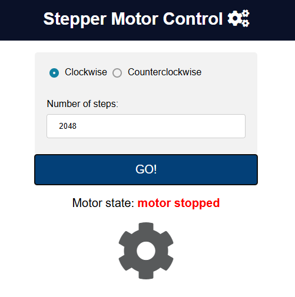
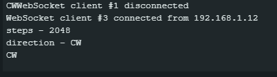

# ESP8266 Stepper Motor Control with Web Interface

## Description

This project enables remote control of a **stepper motor** using an **ESP8266** and a **web-based interface**. Users can specify the **rotation direction (Clockwise or Counterclockwise)** and set the **number of steps** via a responsive web UI. Communication is handled using **WebSockets**, allowing real-time status updates.

## Features

- ✅ **Remote Stepper Motor Control** via a web page
- ✅ **WebSocket Communication** for real-time feedback
- ✅ **LittleFS** for storing web files (HTML, CSS, JS)
- ✅ **Wi-Fi Connectivity** for remote access
- ✅ **Smooth and Precise Movement** using AccelStepper

## How It Works

1. The ESP8266 runs a **web server** that hosts an interactive UI.
2. Users input the **number of steps** and choose a **rotation direction**.
3. The ESP8266 receives commands via **WebSockets** and moves the stepper motor accordingly.
4. The interface displays the **motor status (running/stopped)** in real time.

## Components Used

- **ESP8266 - NodeMCU**
- **Stepper Motor (28BYJ-48)**
- **ULN2003 Motor Driver**
- **Power Supply (5V for motor, 3.3V for ESP8266)**
